# Jetson Image flashing on SSD w/ NVIDIA SDK manager

## 주의 사항

* NVIDIA SDK nanager는 기본적으로 linux 기반의 tool이다. 따라서 windows system에서도 WSL을 사용한다.
  * WSL을 먼저 install 하고 진행한다.
    * powershell에서 아래 명령으로 wsl을 install 한다.

    ```powershell
    wsl --install
    ```

* WSL 환경하에서 USB port on/off를 진행하며 이 때 powershell을 사용한다.
  * powershell은 가장 최신인 7.6.x를 install 하기를 추천한다.
  * 제공한 `.msi`를 이용하여 설치 후 환경변수 `PATH`에 이 folder를 추가하고 우선권을 최상으로 한다.
  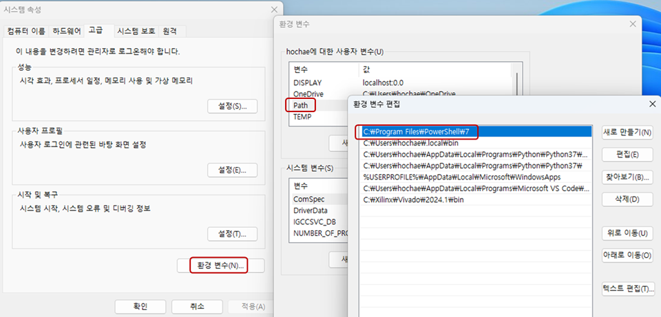
* Downloading 과 install을 동시 진행할 경우 시간이 많이 걸린다.
  * 수업에서는 먼저 Downloading을 진행하고 시차를 두고 install을 진행한다.

## 1. SDK manager 실행하고 login 후 Download 진행

* 실행 초기화면

  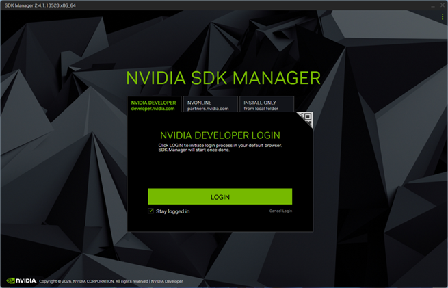
* login click -> login on web-browser (web browser): 계정이 없으면 만들어야 함
  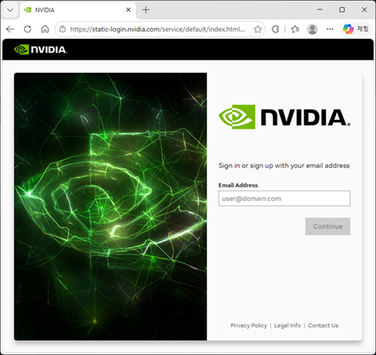
* mail을 확인하라는 message (web browser)

  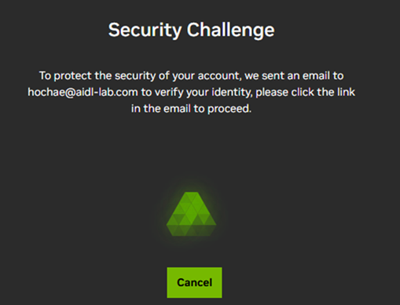
* NVIDIA에서 보내온 메일에서 `Verify`를 눌러 검증

  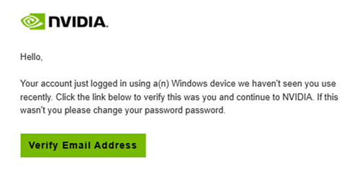
* Email Authentication 완료

  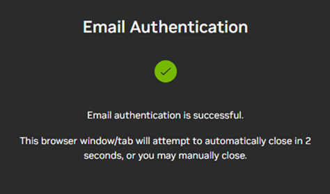
* NVIDIA SDK signing 진행 (web browser)

  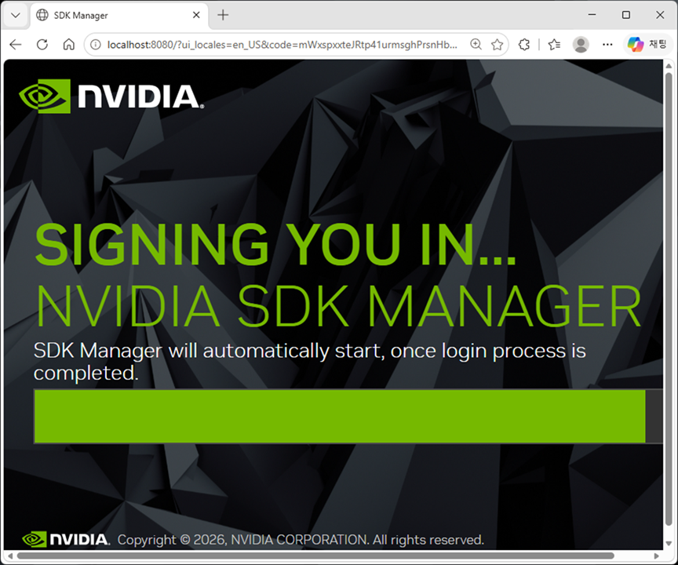
* SDK signing 완료 (web browser)

  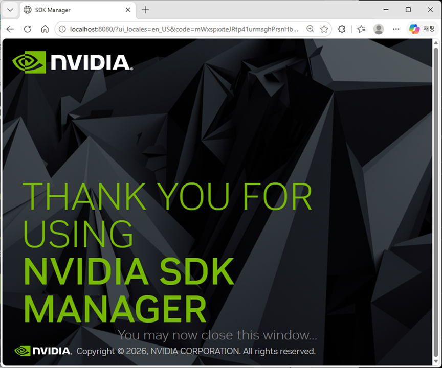
* SDK login 진행

  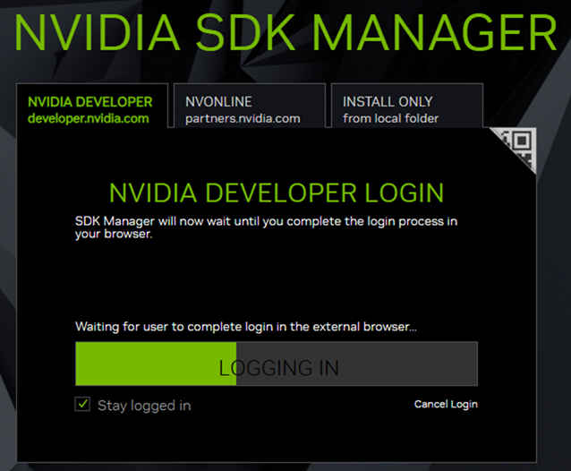
* SDK login 완료 후 new version info : `Later` 선택

  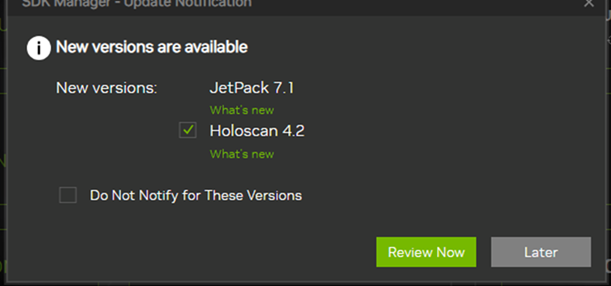
* SDK `Step 01`

  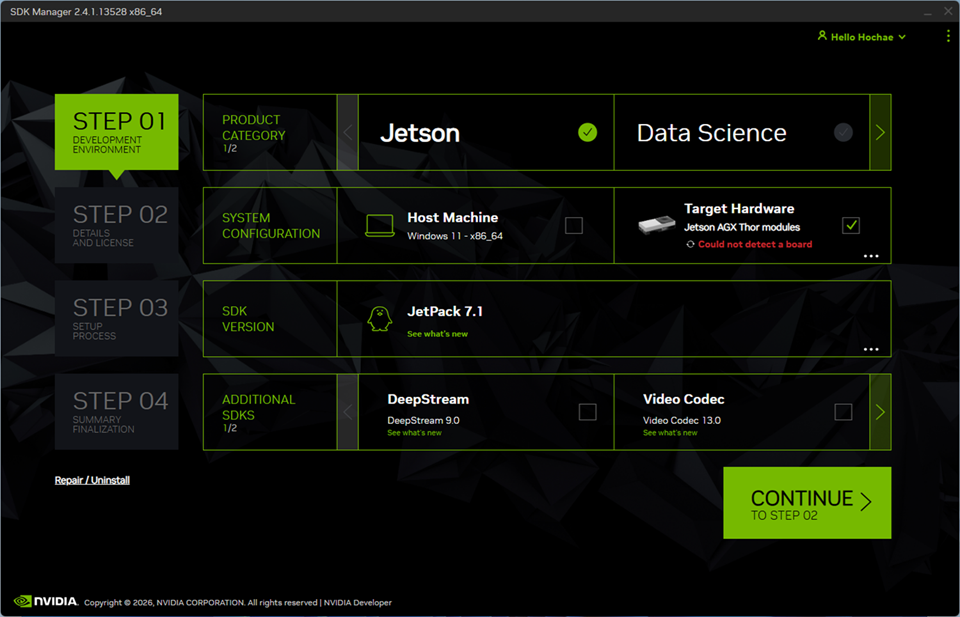
  * SDK `Step 01`: `Target Hardware`를 진행 -> `Jetson Orin Nano modules`
  
  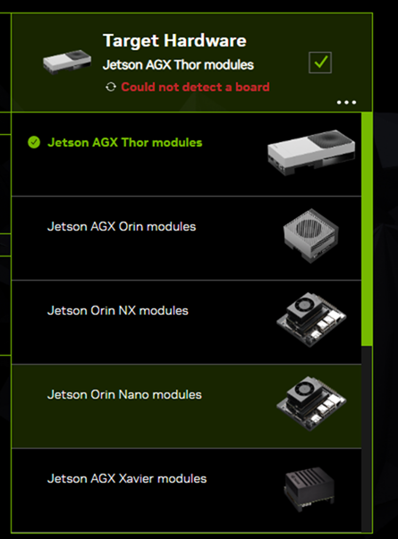
* SDK `Step 02`: `TARGET COMPONENTS` 모두를 선택, `lincense`와 `Download` 선택

  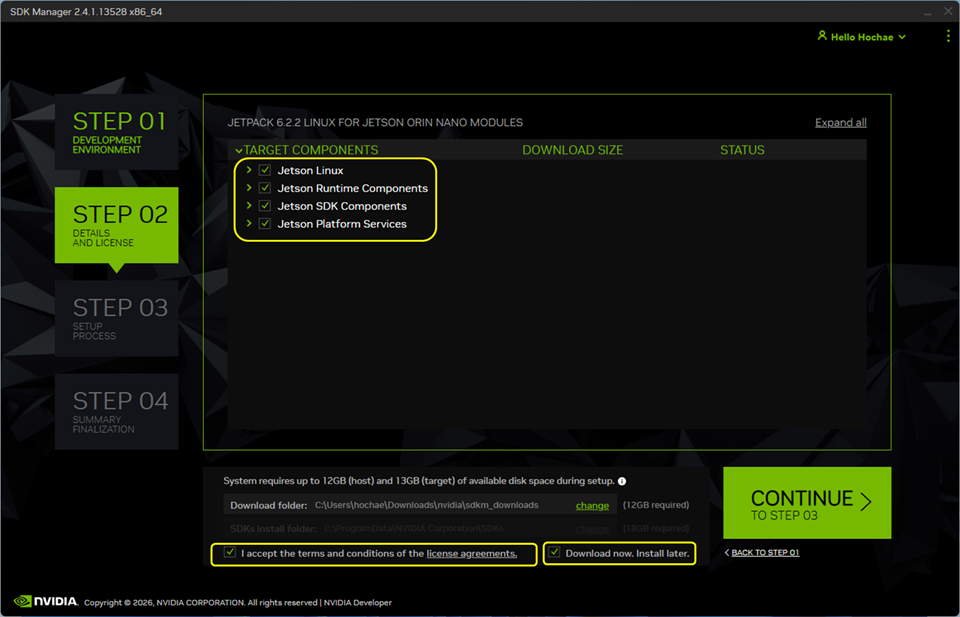
* SDK `Step 03`: Download 진행

  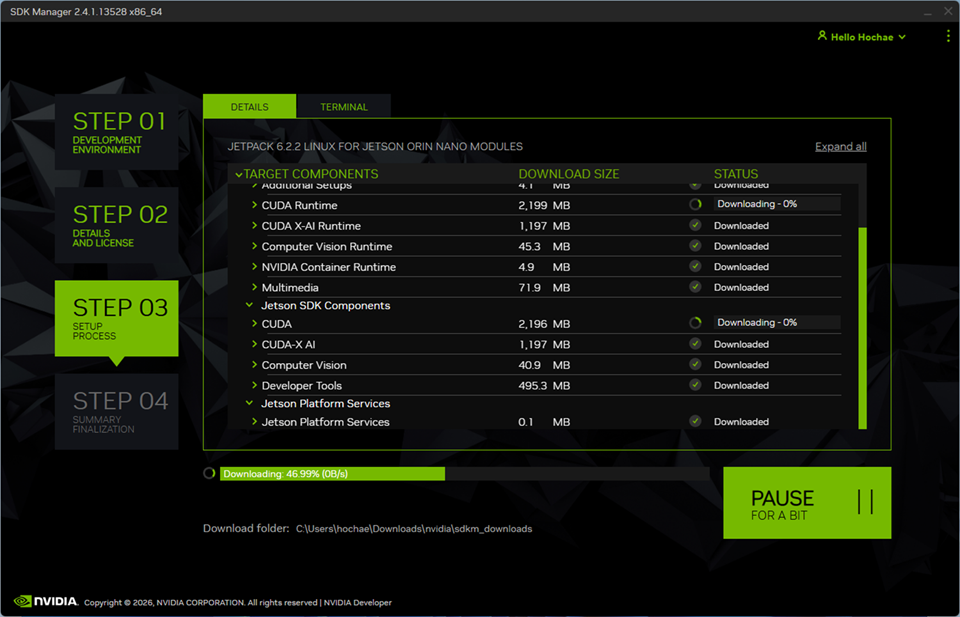
* SDK `Step 04`

  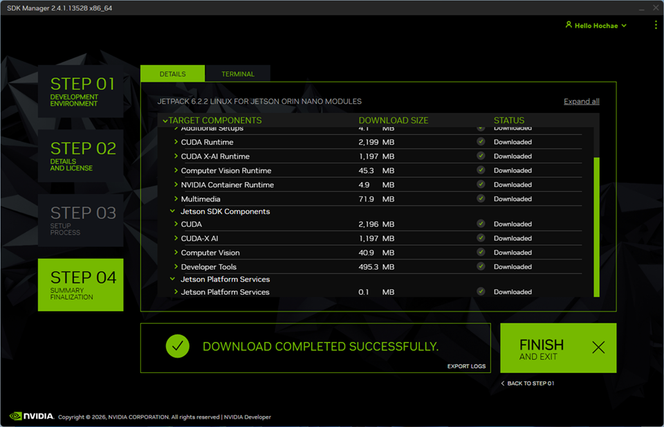

## 2. SSD flashing

* Board 준비
  * image flashing 을 위해 Jetson을 `Rescue` mode로 setting
    * J14(Bustton Header) pin 10,`Force Recovery`pin을 `GND`에 jumper로 연결
  * USB port 연결

    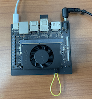
* SDK `Step 01`: 보드 연결을 자동으로 확인

  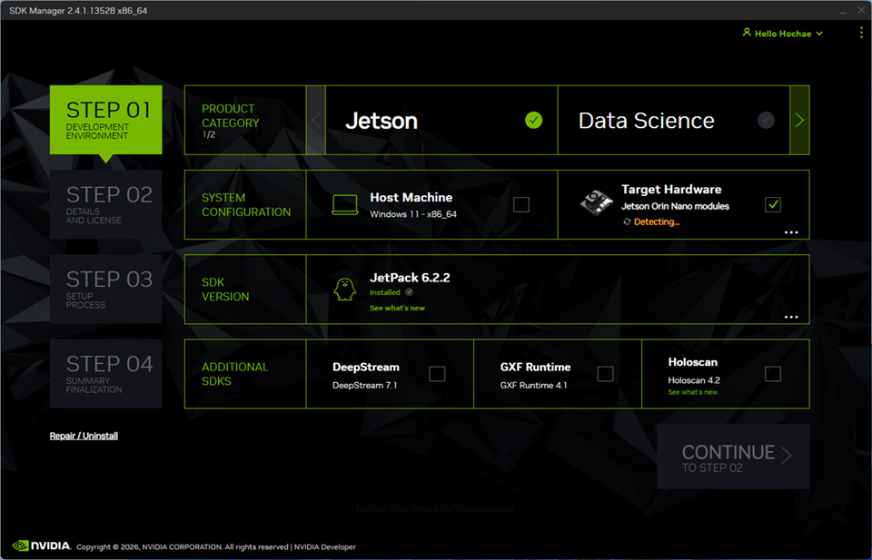
* SDK `Product` selection: 보드 연결이 되면 자동으로 선택 popup이 뜬다
  * `Jeson Orin Nano[8GB developer kit version]` 선택
  
  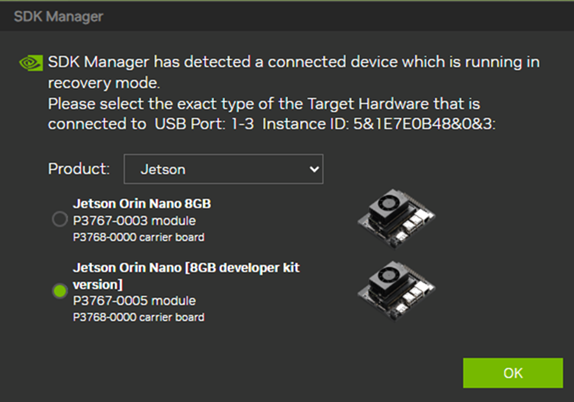
* SDK `Step 02`: `Lincese` 만 check하고 진행
  * 주의 사항: `TARGET COMPONENT` 전체 선택 확인 필수
  
  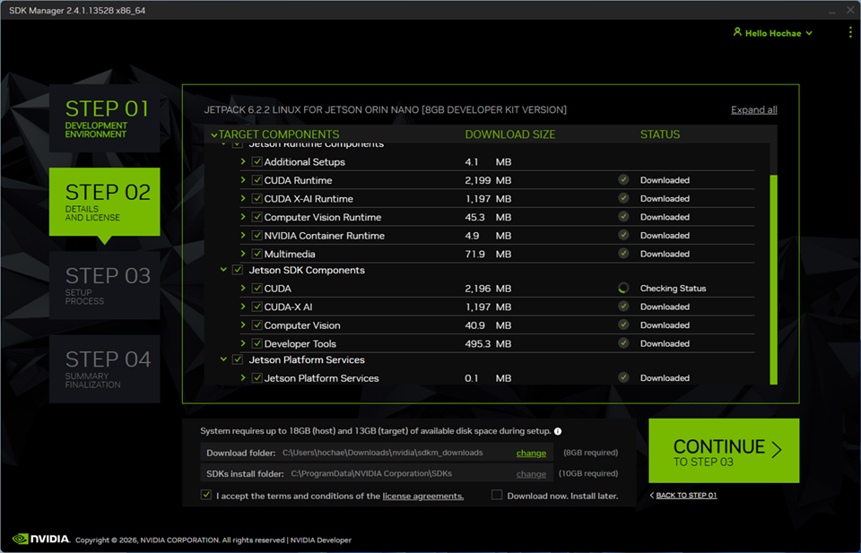
* SDK `OEM Configuration` & `Storage`: 초기 login 필요, 반드시 아래와 같이 지정한다.
  * New Username: `aidl`
  * New Password: `will`
  * Sotrage Device: `NVMe`
  * `Flash`로 다음 진행
  
  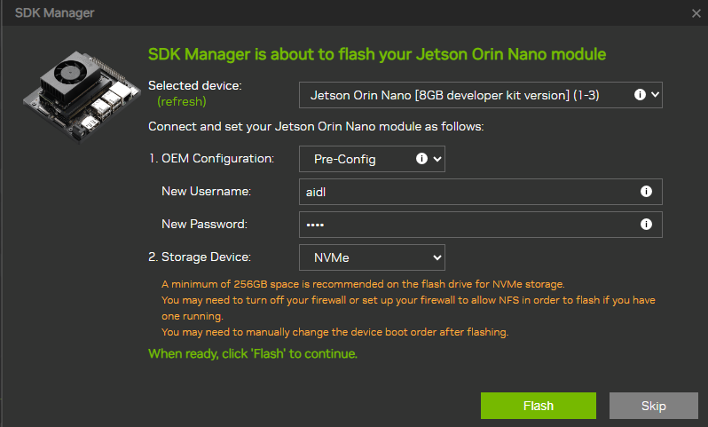
* SDK `Step 03`: `Download only` 를 unmark 하고 진행

  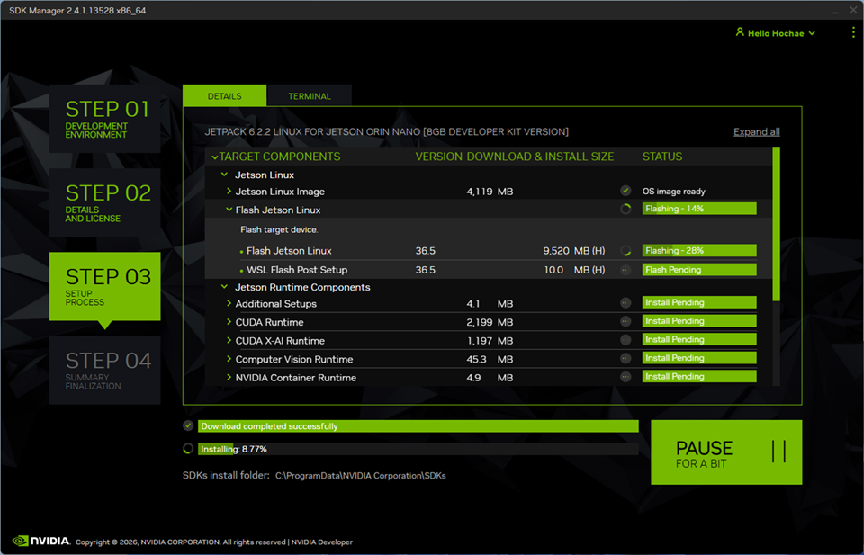
* com port 를 이용하여 jetson b'd 에 login한다. (연결 방법은 [여기]()를 참고한다.)
  * jetson b'd의 ip를 확인한다.
* `SDK components` install 시작 전에 확인 창이 뜬다.

  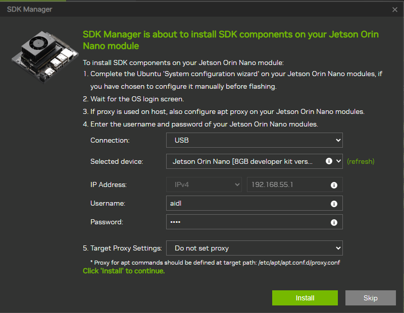
* connection을 `USB`에서 `Wthernet`으로 바꾸고 확인한 ip를 적어 준다.

  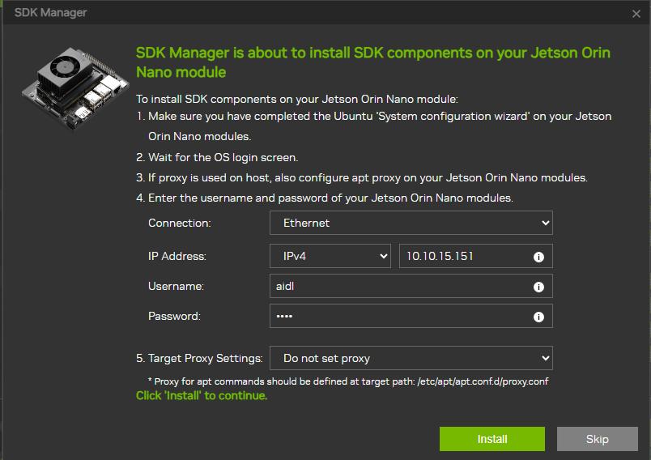
* `Install`을 선택하고 진행
* `verifying Jetson board` 후 진행 됨

  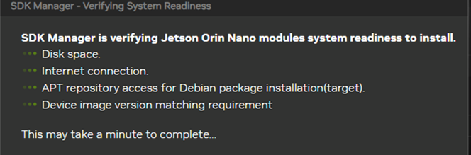
* SDK `Step 04`

  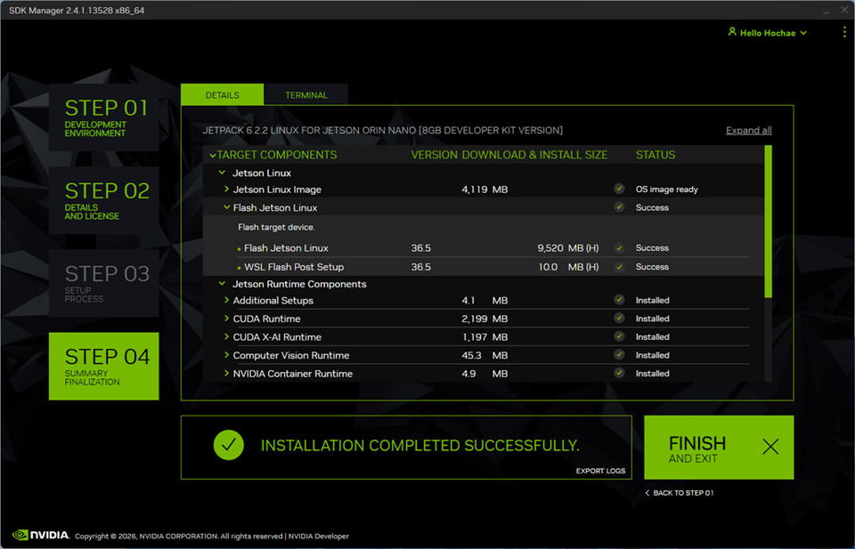

## 3. OEM setup 마무리

* SDK Installation이 끝나면 전원과 rescue mode 점퍼와 usb를 제거한다.
* 키보드, 마우스, 모니터를 연결하고 전원을 인가하여 정상 부팅을 진행한다.

* `aidl` user로 login하고 초기 setup을 진행한다.
* `Power Mode`를 `max`로 바꾼다.
* network setup을 진행한다.
  * `ifconfig` 명령으로 ip를 확인하고 기록한다.
* 아래 명령으로 `hostname`을 `jetson-xxx`로 수정한다.
  * `xxx`는 본인의 수강 번호를 세자리로 표현. 예: 7번 --> `jetson-007`
  ```bash
  sudo hostnamectl set-hostname jetson-007
  ```
* `/etc/hosts` file안의 정보도 수정
  * 수정 전
    ```Plaintext
    127.0.0.1   localhost
    127.0.1.1   ubuntu
    ```

  * 수정 후
    ```Plaintext
    127.0.0.1   localhost
    127.0.1.1   jetson-007
    ```
* 다음 명령으로 jetson을 poweroff한 뒤 전원을 분리한다.

  ```bash
  sudo poweroff
  ```

* jetson board를 `Headless` mode로 전환한다.
  * 키보드, 마우스, 모니터를 분리한다.

## 4. 전원을 연결하고 ssh로 login하자

* 아래 명령을 powershell에서 실항하여 ssh로 login해 보자
  ```Poswershell
  ssh -Y aidl@jetson-007
  ```

  * 연결이 안되면 기록해둔 IP로 연결해 보자
  ```Powershell
  ssh -Y aidl@192.168.1.59
  ```
* 처음 연결하면 연결진행 여부를 묻는다. `yes`하고 login 진행
* passwd를 입력하고 login 한다.
* 아래 명령으로 ubuntu를 update한다.
  ```bash
  sudo apt update
  sudo apt upgrade
  ```
