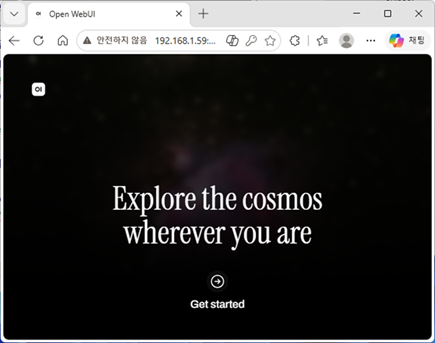
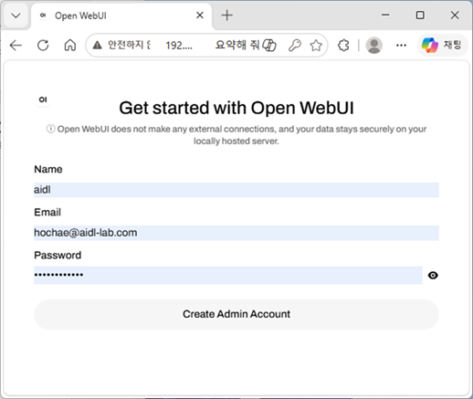
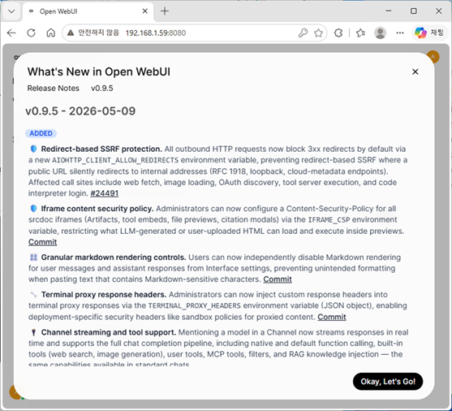
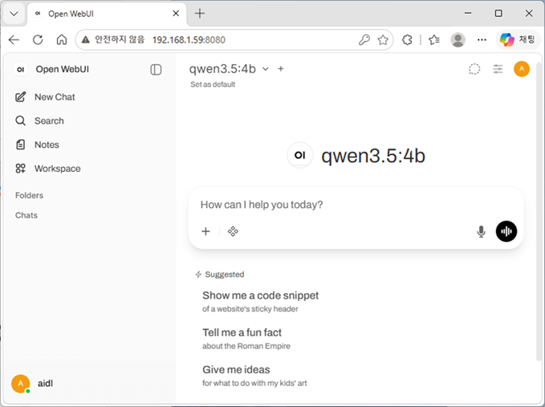
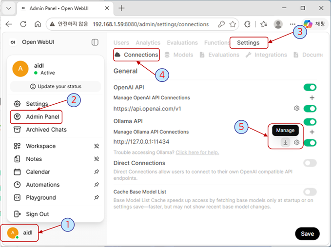
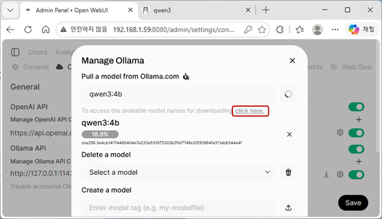

# Open WebUI on Jetson Orin Nano

## 1. run Open WebUI on Docker

Open WebUI는 Docker를 이용해 실행하므로 별도의 install 과정은 없이 다음 명령을 수행하면 된다.

```bash
docker run -d --network=host -v open-webui:/app/backend/data -e OLLAMA_BASE_URL=http://127.0.0.1:11434 --name open-webui --restart always ghcr.io/open-webui/open-webui:main
```

* `run`: 새로운 docker container를 생성하고 실행하라는 명령어
* `-d` (Detached mode): container를 background에서 실행
* `--network=host`: host PC의 network 환경을 공유하겠다는 설정
* `-v` (Volume): docker와 host가 공유하는 영역,
  * `open-webui:/app/backedn/data`  docker 내 경로 
  * host pc 경로: /var/lib/docker/volumes/open-webui/_data/
* `-e‘ (Environment): Container 내부 환경 변수,
  * `OLLAMA_BASE_URL=http://127.0.0.1:11434`  ollama 주소
  * Open WebUI에게 인공지능 모델을 구동하는 backend engine인 ollama 주소를 알려줌
  * `--network=host`로 하였으므로 127.0.0.1 (localhost address) 은  jetson 의 ollama를 지정하는 것임.
  * `:11434` : ollama service 의 port #

* `--name ope-webui`: 생성될 container의 이름 지정  docker image id 대신 사용 가능
* `--restart always`: 자동 재시작 정책 적용
* `ghcr.io/open-webui/open-webui:main`: docker image 주소와 tag
ghcr (GitHub Container Registry)에 등록된 Open WebUI의 가장 최신 안정 버전( main)

## 2. Web-browser를 열고 접속해 보자

```text
http://<jetson.ip>:8080
```

* web-browser를 열고 점속

  

## 3. `Get started`를 선택하고 login 과정을 거치자

* admin 계정이 없다면 다음과 같이 만들고 login

  

* Open WebUI version 정보 확인: 처음 연결 시

  

* Chatting 창: looks like open LLM models' site

  

* ollama model을 pull 해보자

  * `Admin Panel -> Settings -> Connections -> ollama manage` 선택

    

  * Manage Ollama popup 에서 model name을 적고 pulling

    
