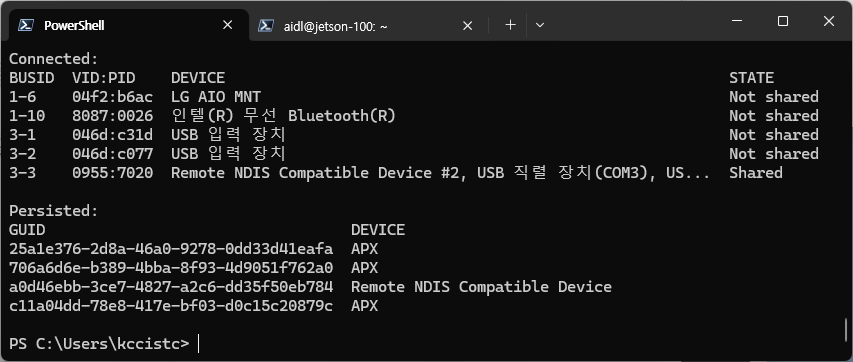
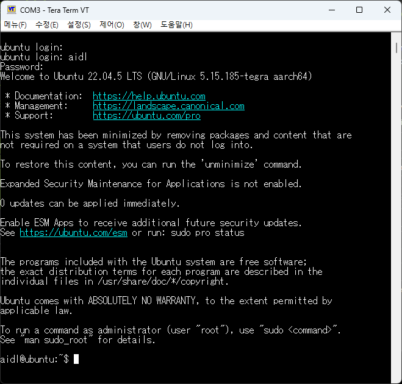

# Jetson USB login
  jetson board에 연결된 USB port가 `Ubuntu`에 종속되어 windows에서 사용할 수 없는 상태인지 확인하여야 한다.

  * 아래 명령을 통해 현재 상태를 확인한다.

    ```powershell
    usbipd list
    ```

  * 결과가 아래 그림과 같이 `shared`로 나오면 정상이다.

    

  * `shared`상태가 아니면 아래 명령으로 shared 상태로 만든다.

    ```powershell
    usbipd bind --busid <BUSID>
    ```

* Serial terminal tool을 이용하여 `com port`로 연결한다.
  * `teraterm` 연결 예제: `115200 8 N`

  
  
